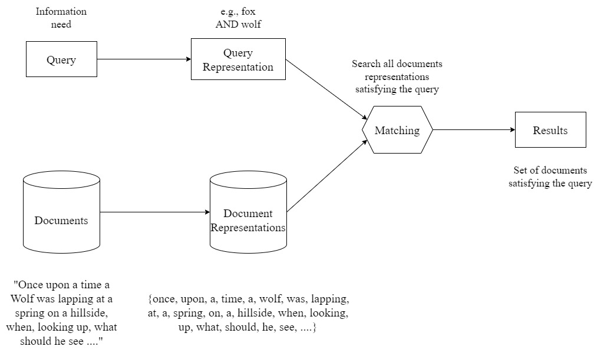

# Information Retrieval System

This repository implements an information retrieval (IR) system, covering key components and models essential for any IR architecture.

## System Architecture

The following diagram illustrates the main building blocks typically found in an information retrieval system:



## Dataset

The system uses the **aesopa10** dataset, a collection of Aesop's fables. This dataset is valuable for testing information retrieval techniques as it provides a diverse set of short, story-based documents, ideal for evaluating retrieval methods on natural language content. The dataset includes multiple fables, allowing testing of retrieval accuracy and relevance ranking based on keyword searches and vector similarity.

## Features

- **Inverted List Boolean Model**: This model creates an index for each word, mapping it to the documents containing the word. The inverted index structure supports efficient Boolean retrieval.

- **Signature-Based Boolean Model**: This model segments each document into blocks, storing a unique signature (hash) for each block. This approach leverages hashing for efficient retrieval of block-based data.

- **Vector Space Model**: This model represents both queries and documents as vectors, where each element corresponds to term frequency. It uses the TF-IDF (term frequency-inverse document frequency) approach to compute relevance.

- **Buckley-Lewit Algorithm**: A widely-used retrieval algorithm that leverages document and query vector representations for efficient document ranking and retrieval.

- **Utilities**: Includes helper functions for:
  - **Stemming**: Uses the Porter stemming algorithm to reduce words to their root forms.
  - **Stop Words Removal**: Offers two options:
    1. Using a predefined stop words list.
    2. Dynamically generating a stop words list using the J.C. Crouch (1990) method.

- **Information Retrieval System Evaluation**: The IR system is evaluated using two critical metrics:
  - **Precision**: Measures the proportion of relevant documents retrieved out of the total documents retrieved.
    `Precision = (Number of Relevant Documents Retrieved) / (Total Number of Documents Retrieved)`

  - **Recall**: Measures the proportion of relevant documents retrieved out of the total relevant documents available.
    `Recall = (Number of Relevant Documents Retrieved) / (Total Number of Relevant Documents)`

- **Query Processing Time**: Users can toggle between retrieval models to observe and compare the time taken by each model to retrieve documents, displayed as `Query Processing Time` in the interface.

## Information Retrieval System Demo

A demonstration of the Information Retrieval System is available, showcasing the retrieval models, evaluation metrics, and query processing comparisons.


https://github.com/user-attachments/assets/e575f2a1-c3b1-4cfc-949b-095cea069384


## Prerequisites

Ensure that the following dependencies are installed:
- Python >= 3.10.0
- `pyparsing`

To install dependencies, run:

```bash
pip install -r requirements.txt
```

## Usage

To start the Information Retrieval System, run:

```bash
python ir_system.py
```
